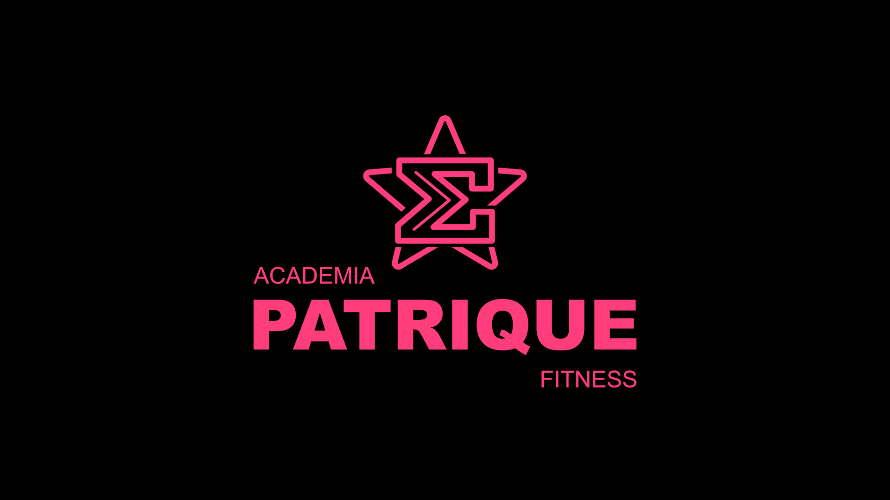

# 🏋️‍♂️ Patrique Fitness — App de Academia

<p align="center">
  
</p>

<p align="center">
  
  
  
  
</p>

<p align="center">
  <a href="../README.md">🇺🇸 English</a> | 🇧🇷 Português
</p>

---

## 📱 Sobre o projeto

A **Patrique Fitness** é um aplicativo mobile de academia desenvolvido em Flutter, criado como projeto de portfólio e trabalho acadêmico. O app oferece uma experiência gamificada de gerenciamento de treinos, nutrição e interação social entre usuários — inspirado na dinâmica de engajamento do Duolingo aplicada ao mundo fitness.

---

## ✨ Funcionalidades

### 🔐 Autenticação
- Splash screen com logo animada e tema dinâmico (claro/escuro)
- Onboarding interativo para novos usuários
- Login e cadastro com validação de campos

### 🏠 Home
- Saudação personalizada ao usuário
- Card de streak com dias consecutivos de treino
- Visão semanal de treinos realizados
- Efeito shimmer de carregamento
- Cards de próximos treinos clicáveis com navegação direta

### 💪 Treinos
- Lista de treinos organizados por grupo muscular (A, B, C)
- Tela de detalhes com exercícios, séries, cargas e intervalos
- Execução de treino com cronômetro total em tempo real
- Player de vídeo do YouTube integrado para cada exercício
- Timer de intervalo entre séries com opção de pular
- Tela de conclusão com avaliação por estrelas e atualização do streak
- Criação de treinos personalizados com arrastar para reordenar

### 📅 Calendário
- Visualização mensal dos dias treinados estilo Duolingo
- Streak calculado automaticamente
- Estatísticas: streak atual, treinos no mês e total geral

### 🤖 Chatbot
- PratiqueBot com árvore de decisões completa
- Dúvidas sobre treino, nutrição e recuperação
- Histórico da conversa com respostas rápidas interativas

### 👥 Amigos
- Lista de amigos com status online em tempo real
- Perfil completo de cada amigo com estatísticas
- Ranking semanal gamificado com pódio (🥇🥈🥉)
- Desafios semanais e mensais entre amigos com sistema de pontos

### 🥗 Nutrição
- Controle de calorias diárias com barra de progresso
- Acompanhamento de macronutrientes (proteína, carboidrato, gordura)
- Refeições expansíveis com checklist (café, almoço, lanche, jantar)
- Histórico semanal de dieta com streak
- Agendamento de consulta com nutricionista via WhatsApp

### 💳 Planos
- Planos mensal e anual com comparativo de preços
- Tela de confirmação de assinatura

### 👤 Perfil
- Dados pessoais e físicos editáveis (nome, peso, altura)
- Objetivo e nível de experiência personalizáveis
- Estatísticas de treino (streak, treinos no mês, total)
- Gerenciamento de planos
- Notificações locais com lembrete diário configurável
- Toggle de tema claro e escuro persistente

---

## 🎨 Identidade visual

| Cor | Hex | Uso |
|-----|-----|-----|
| Rosa principal | `#FF3E7D` | Cor primária, botões, destaques |
| Rosa escuro | `#D61A5E` | Gradientes |
| Rosa claro | `#F8A9D5` | Textos sobre fundo escuro |
| Fundo escuro | `#111217` | Background modo escuro |
| Superfície escura | `#1C1D21` | Cards modo escuro |

---

## 🛠️ Tecnologias e pacotes

| Pacote | Versão | Uso |
|--------|--------|-----|
| `flutter` | 3.41.7 | Framework principal |
| `youtube_player_flutter` | 9.x | Player de vídeo nos treinos |
| `shared_preferences` | — | Persistência local |
| `flutter_local_notifications` | 17.x | Lembretes de treino |
| `shimmer` | — | Efeito de carregamento |
| `flutter_launcher_icons` | — | Ícone do app |

---

## 📁 Estrutura do projeto

```
lib/
├── core/
│   ├── theme/
│   │   ├── app_theme.dart          # Temas claro e escuro
│   │   ├── app_transitions.dart    # Animações de navegação
│   │   └── theme_utils.dart        # Extensões de contexto
│   ├── notification_service.dart   # Serviço de notificações
│   └── theme_controller.dart       # Controlador de tema
├── features/
│   ├── auth/
│   ├── home/
│   ├── treino/
│   ├── chatbot/
│   ├── amigos/
│   ├── nutricao/
│   └── perfil/
├── shared/
│   └── widgets/
└── main.dart
```

---

## 🚀 Como rodar o projeto

### Pré-requisitos
- Flutter 3.41.7 ou superior
- Xcode 16+ (para iOS)
- CocoaPods instalado

### Instalação

```bash
# Clone o repositório
git clone https://github.com/seu-usuario/patrique_app.git

# Entre na pasta
cd patrique_app

# Instale as dependências
flutter pub get

# Rode o app no simulador
flutter run
```

---

## 📸 Screenshots

> Em breve

---

## 🗺️ Próximos passos

- [ ] Integração com Firebase (autenticação real e banco de dados)
- [ ] Personagens ilustrados nas telas (Patrique Estrela e Chad Esponja)
- [ ] Integração com pagamento real (RevenueCat)
- [ ] Versão Android
- [ ] Testes automatizados

---

## 👨‍💻 Créditos

Desenvolvido por **Victor Hasse**, **Bernardo Santos Vieira**, **Guilherme Mitsuo Honda**, **Igor Vinicius Sotili Mirandolli**

[](https://github.com/victorhasse)
[](https://github.com/BernardoSVieira)
[](https://github.com/lmitsuol)
[](https://github.com/IgorMirandolli)

Projeto acadêmico e de portfólio — 2026

---

## 📄 Licença

Este projeto está sob a licença MIT.